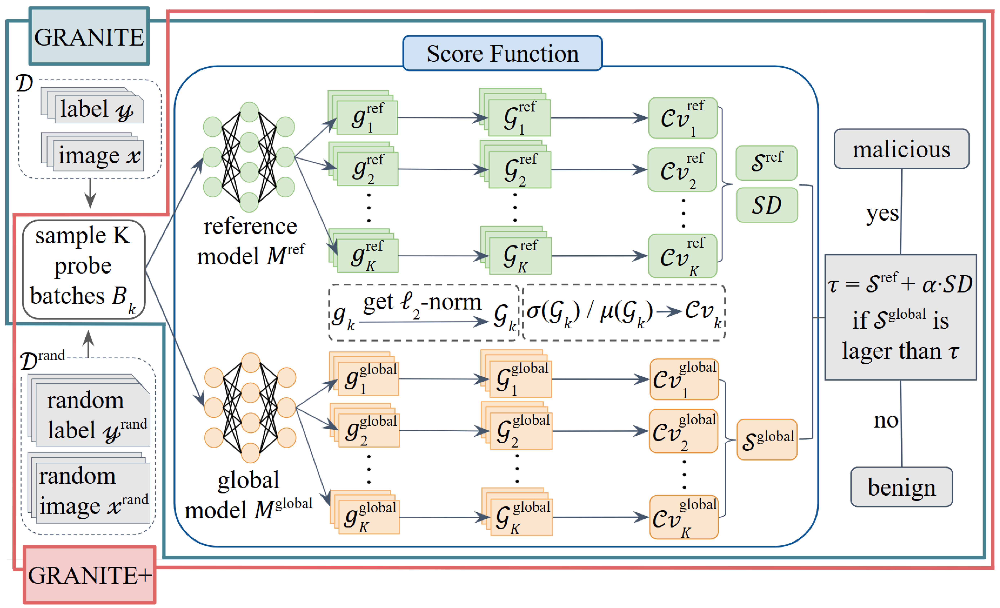

# Code for IEEE ICC 2026 Paper Submission "GRANITE: Gradient Norm Inspection Technique for Malicious Server Detection in Federated Learning"



This repository contains the official implementation of all experiments in the paper. It includes code to run training/evaluation, store intermediate results, and reproduce all figures and tables.

## Repository Overview
- **exp**: Scripts for all experiments reported in the paper. Each script generates the intermediate results used for the corresponding figure or table.
- **results**: Stored experiment outputs (e.g., .pkl files) read by the plotting notebook.
- **plot.ipynb**: Notebook that loads data from results and reproduces all paper figures and tables.
- **models**: Model definitions and related helpers.
- **dataloader**: Data loading utilities for CIFAR-10, CIFAR-100, TinyImageNet and Food101 datasets.
- **utils**: General utilities for training, evaluation, and plotting.
- **weights**: Pretrained ResNet-18 checkpoints for the client model.
- **seer_weights**: Pretrained SEER model checkpoints.

Pre-computed results are included so that users can directly run plot.ipynb without re-running the experiments.

## Environment Setup

From the project root, create and sync a Python virtual environment using `uv`:

```bash
uv venv --python 3.11.12
source .venv/bin/activate
uv pip sync requirements.txt
```

### Download Pretrained Model Weights
Before running experiments, download the pretrained model weights from Hugging Face. Run the following commands from the repository root directory:
```bash
pip install huggingface_hub
huggingface-cli download Yue-2003/GRANITE \
    --repo-type model \
    --local-dir ./
```
This will download the pretrained model weights into the `weights` and `seer_weights` folders.

## Reproducing Figures and Tables (Using Pre-computed Results)
All necessary result files are already prepared in results. To reproduce the paper figures and tables, simply run the Jupyter notebook plot.ipynb:

```bashcd /trainingData/sage/GRANITE
jupyter notebook
```

Then open plot.ipynb and run all cells in order. This directly generates:

- Figure 2a
- Figure 2b (Experiment 1)
- Figure 3a, 3b, 4a, 4b (Experiment 9)
- Figure 5a, 5b, 5c (Experiment 11)
- Table 1 (Experiment 2)
- Table 2 (Experiment 3)
- Table 3 (Experiment 8)

## Re-running Experiments (Optional)
If you want to regenerate results from scratch, you can run the experiment scripts in exp. The mapping from scripts to paper items is:

- experiment_1.py → Figure 2b
- experiment_9.py → Figure 3a, 3b, 4a, 4b
- experiment_11.py → Figure 5a, 5b, 5c
- experiment_2.py → Table 1
- experiment_3.py → Table 2
- run_exp8.sh → Table 3

Example commands:

```python
uv run -m exp.experiment_1
uv run -m exp.experiment_2
uv run -m exp.experiment_3
uv run -m exp.experiment_9
uv run -m exp.experiment_11
bash exp/run_exp8.sh
```

Each script will write its outputs into results, which are then consumed by plot.ipynb.
